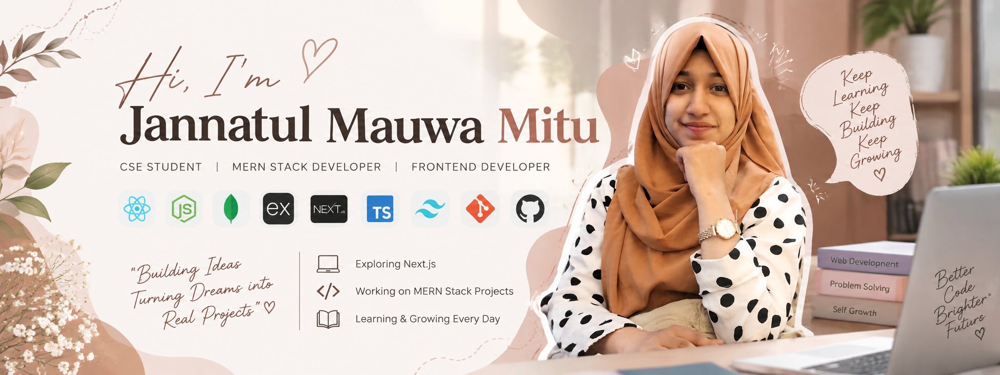

<!-- ===================== BANNER ===================== -->

  

<h1 align="center">Hi 👋, I'm Jannatul Mauwa Mitu</h1>

<h3 align="center">
  CSE Student | MERN Stack Developer | Frontend Developer
</h3>

  
  
  

---

## 👩‍💻 About Me

I'm a Computer Science and Engineering student and a passionate web developer
who enjoys building modern, responsive, and user-friendly web applications.

I mainly work with the **MERN Stack** and enjoy turning ideas into functional
and visually appealing websites. I am continuously learning new technologies
and improving my problem-solving and development skills.

- 🌱 Currently exploring **Next.js**
- 💻 Working on **MERN Stack projects**
- 🎨 Interested in **Frontend Development & UI/UX**
- 🔐 Learning more about **Authentication, REST APIs & Backend Development**
- 🚀 Building projects to improve my real-world development skills
- 📚 Continuously learning and improving my programming skills

---

## 🛠️ Skills & Technologies

  
  
  
  
  
  
  
  
  
  
  
  
  
  

---

## 🚀 Current Activities

<table>
<tr>
<td width="50%">

### 💻 Development

- Building MERN Stack applications
- Developing responsive React interfaces
- Working with REST APIs
- Implementing JWT authentication
- Working with MongoDB & Express.js

</td>

<td width="50%">

### 📚 Learning

- Exploring Next.js
- Improving TypeScript skills
- Learning advanced React concepts
- Practicing problem solving
- Exploring modern web development

</td>
</tr>
</table>

---

## 📊 GitHub Statistics

  

  

---

## 🔥 GitHub Streak

  

---

## 📈 Contribution Graph

  

---

## 🌐 Connect With Me

  

  

  

  

---

## 💡 Featured Projects

### 🛒 SmartShop
MERN Stack based e-commerce application with authentication,
product management, cart and checkout functionality.

### 🍔 FoodExpress
A food delivery web application built using React, Tailwind CSS,
Node.js, Express.js and MongoDB.

### 🏠 Smart Hostel Management System
A web-based hostel management system with student registration,
seat allocation, waiting list management and admin functionalities.

---

## 🐍 Contribution Snake

  

---

<h3 align="center">
  ✨ "Keep Learning, Keep Building, Keep Growing." ✨
</h3>

  Thanks for visiting my profile! ❤️

